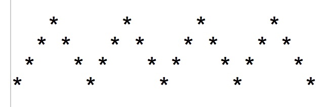

# Print a Wave Pattern

Create a C Program that generates a triangular pulse train:

Enter period: 6

 1. Use only the character '*' to draw the triangular pulse
 2. Pulse period is multiple of 2 only: min = 2, max = 40; Amplitude is equal to half of the period.
 3. Pulse number of period to show – max of your terminal width
